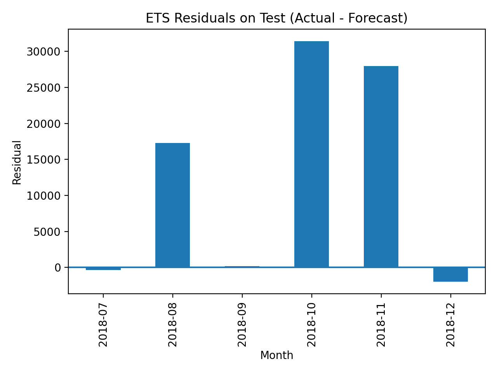
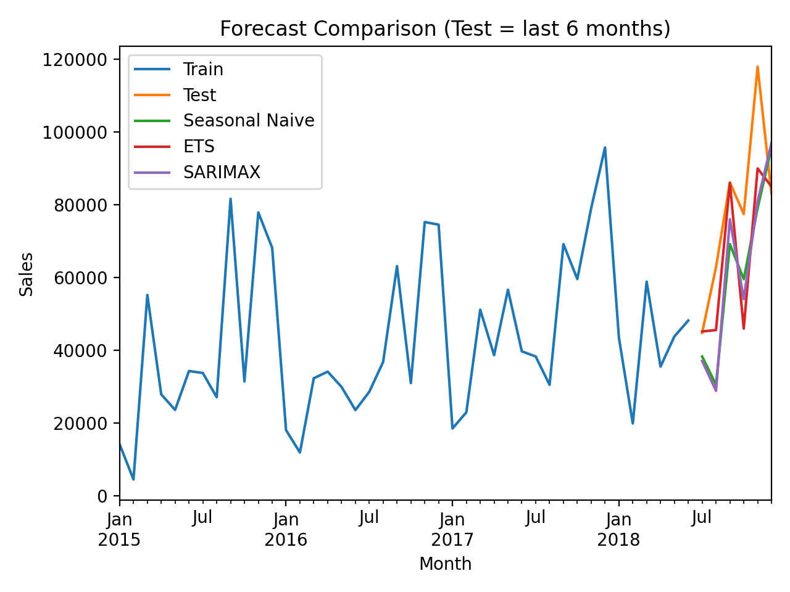

# Hybrid Sales Forecasting (ETS vs Prophet)

A professional time series forecasting project that applies a **hybrid forecasting strategy** by combining classical statistical models (ETS) with modern machine learning forecasting (Prophet), optimized using rolling cross-validation and hyperparameter tuning.

---

## 📌 Project Overview

Sales forecasting is critical for business planning, inventory optimization, and decision-making.  
However, different product categories often show different demand behaviors:

- Some categories are stable and predictable  
- Others are volatile due to promotions, trend shifts, or seasonal spikes  

To address this, this project implements a **Hybrid Forecasting Framework**, selecting the best forecasting model per category.

This project uses the **E-Commerce Orders Dataset** from Kaggle, which contains online retail order transactions such as order dates, product categories, and sales values. The dataset was used to perform category-level sales forecasting.

Source: https://www.kaggle.com/datasets/tanishqpratap/e-commerce-orders-dataset

---

## 🚀 Key Features

- Group-level forecasting by **Category** (extendable to Region)
- Monthly time series aggregation from transactional retail data
- **ETS (Holt-Winters)** baseline forecasting
- **Prophet forecasting** with:
  - Holiday effects  
  - Log transformation  
  - Hyperparameter tuning  
  - Rolling Cross-Validation (more reliable evaluation)
- Hybrid strategy: choose ETS or Prophet per group based on lowest RMSE
- Automated report outputs (CSV + charts)

---

## 🧠 Models Implemented

### 1. ETS Baseline (Holt-Winters)

Used as a strong benchmark model, especially effective for stable demand patterns.

### 2. Prophet Forecasting (Tuned + CV)

Prophet is applied for categories with higher volatility and nonlinear demand trends.

Prophet is enhanced with:

- Changepoint flexibility  
- Seasonality tuning  
- Holiday impact modeling  
- Rolling cross-validation evaluation  

---

## 📊 Model Selection Results

The best model was chosen per category based on RMSE performance:

| Category          | ETS RMSE | Prophet CV RMSE | Selected Model |
|------------------|----------|----------------|----------------|
| Furniture        | 5047.93  | 4588.89        | Prophet ✅     |
| Office Supplies  | 7611.67  | 8820.22        | ETS ✅         |
| Technology       | 10098.34 | 8197.56        | Prophet ✅     |

Model selection count:

- Prophet selected: **2 categories**
- ETS selected: **1 category**

---

## ⚙️ Best Prophet Parameters (Per Category)

| Category          | changepoint_prior_scale | seasonality_prior_scale | holidays_prior_scale | mode      |
|------------------|--------------------------|--------------------------|----------------------|----------|
| Furniture        | 0.1                      | 5                        | 1                    | additive |
| Office Supplies  | 0.1                      | 1                        | 5                    | additive |
| Technology       | 0.1                      | 10                       | 10                   | additive |

---

## 📈 Example Forecast Output (Prediction + 95% Interval)

Below is an example of the forecasted monthly sales results generated by the model:

| Month       | Forecast Sales | Lower 95% | Upper 95% |
|------------|--------------:|----------:|----------:|
| 01/01/2019 | 49,032.33     | 30,781.34 | 67,283.33 |
| 01/02/2019 | 41,201.68     | 22,950.69 | 59,452.67 |
| 01/03/2019 | 72,188.54     | 53,937.55 | 90,439.53 |
| 01/04/2019 | 60,605.18     | 42,354.19 | 78,856.17 |
| 01/05/2019 | 67,524.83     | 49,273.84 | 85,775.82 |
| 01/06/2019 | 62,605.66     | 44,354.67 | 80,856.66 |

This table shows:

- **Forecast_Sales** = predicted monthly sales  
- **Lower_95 / Upper_95** = confidence interval bounds  
- Helps businesses understand prediction uncertainty  

---

## 🖼️ Visualizations Included

The project generates multiple charts for performance evaluation and forecasting insights:

### 📌 ETS Residual Image

### 📌 Forecast Comparison

### 📌 Monthly Sales Trend

### 📌 Seasonality Boxplot

---

## 📂 Outputs Generated

All results are exported automatically into:

- `evaluation_hybrid.csv`
- `hybrid_forecast_<category>.csv`
- `hybrid_forecast_<category>.png`
- `best_prophet_params.csv`
- `holidays_used.csv`
- `model_choice_summary.txt`

---

## ✅ Business Value

This hybrid forecasting framework provides:

- More accurate predictions by adapting models per category  
- Strong benchmarking using ETS  
- Better handling of volatility with tuned Prophet  
- Reliable evaluation through rolling cross-validation  
- Decision support for inventory and sales planning  

---

## 👤 Author

**Norazlina Shariff**  
Data Analyst Portfolio Project  
Time Series Forecasting • Prophet • ETS • Power BI Analytics

---
