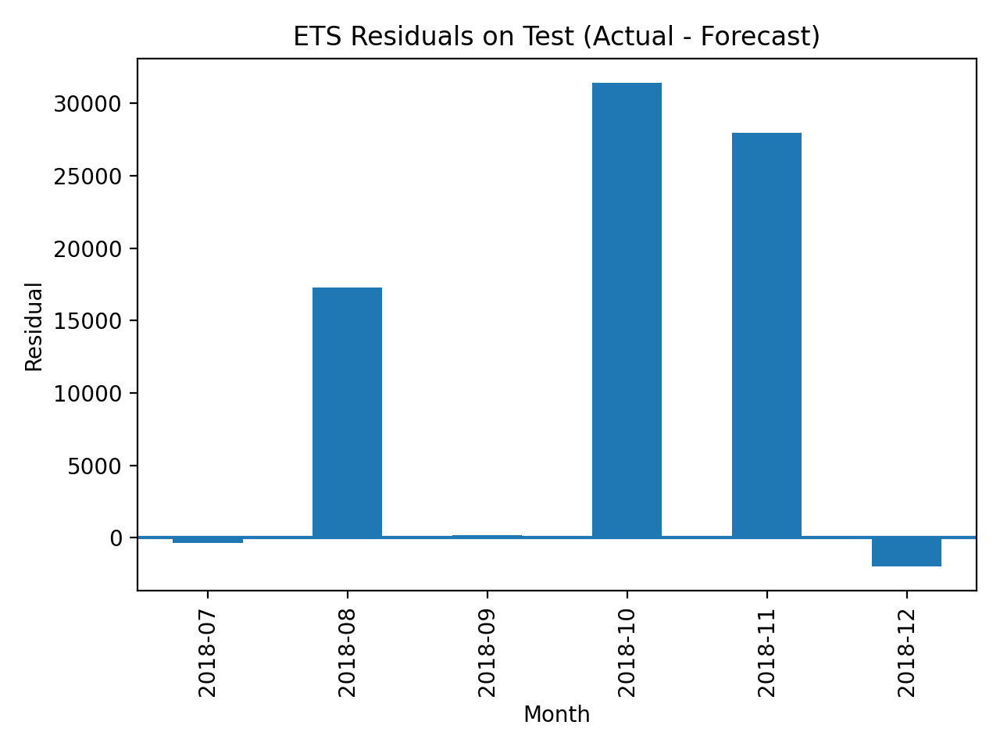
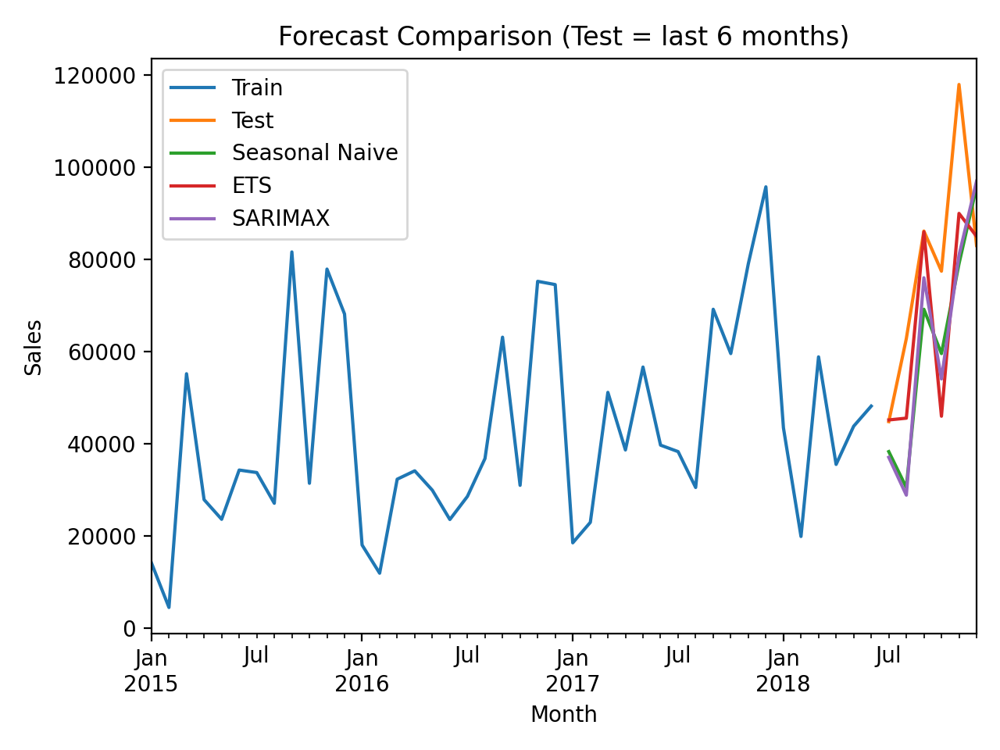
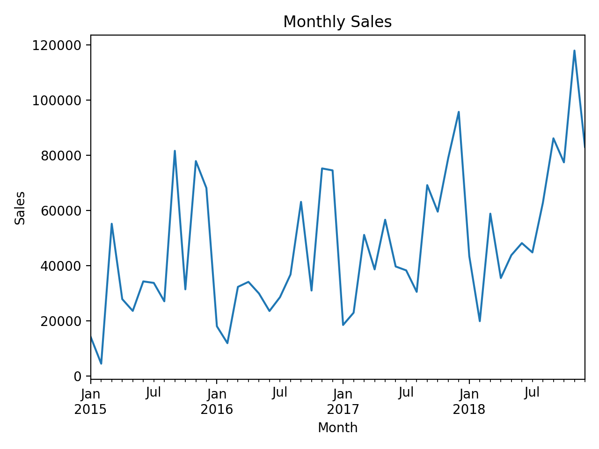
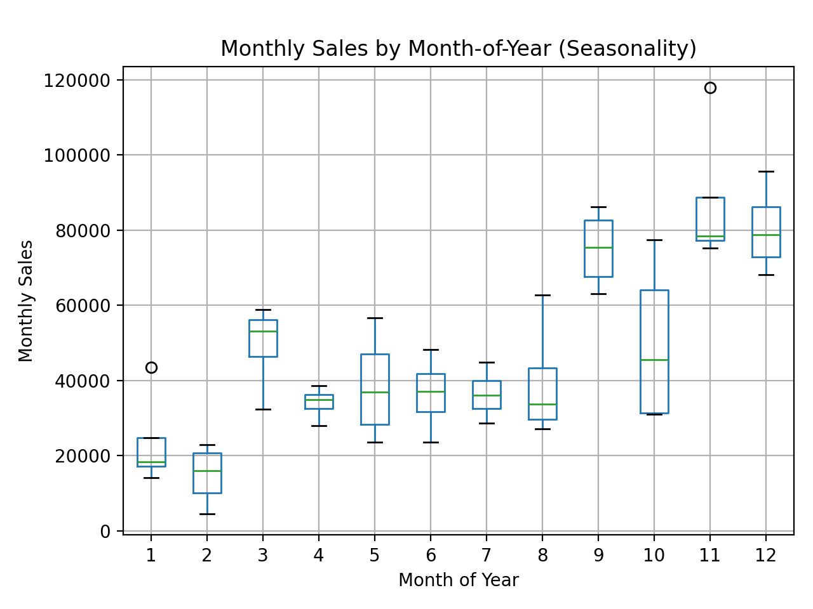

This project uses the **E-Commerce Orders Dataset** from Kaggle, which contains online retail order transactions such as order dates, product categories, and sales values. The dataset was used to perform category-level sales forecasting.

**Source:**  
https://www.kaggle.com/datasets/tanishqpratap/e-commerce-orders-dataset

---

## 💼 Business Impact

This project demonstrates how a hybrid forecasting strategy can directly improve operational and financial decision-making in retail businesses.

---

## 📊 Forecasting Visual Insights

### 📌 ETS Residual Analysis

The residual analysis evaluates model stability and identifies whether forecast errors are randomly distributed. This helps ensure the ETS baseline is statistically reliable before deployment.

---

### 📌 Forecast Comparison (ETS vs Prophet)

This comparison chart visualizes the performance difference between ETS and Prophet models across categories, supporting data-driven model selection.

---

### 📌 Monthly Sales Trend

This trend visualization shows historical sales patterns, enabling:

- Demand seasonality understanding  
- Revenue trend analysis  
- Business cycle identification  

---

### 📌 Seasonality Boxplot

The seasonality boxplot highlights monthly variation patterns and volatility differences across time, helping identify stable vs high-variance categories.

---

## 📦 1. Inventory Optimization

More accurate category-level forecasting enables companies to:

- Reduce overstock and holding costs  
- Prevent stockouts during peak demand  
- Improve warehouse allocation and replenishment planning  

By selecting the best-performing model per category, the system ensures forecasting strategies are not one-size-fits-all.

---

## 📊 Model Selection Summary

The hybrid framework selects the best model per category based on RMSE performance:

| Category          | ETS RMSE | Prophet CV RMSE | Selected Model |
|------------------|----------|----------------|----------------|
| Furniture        | 5047.93  | 4588.89        | Prophet ✅     |
| Office Supplies  | 7611.67  | 8820.22        | ETS ✅         |
| Technology       | 10098.34 | 8197.56        | Prophet ✅     |

### Model Selection Count

| Model    | Selected Categories |
|----------|--------------------|
| Prophet  | 2                  |
| ETS      | 1                  |

This shows that different demand behaviors require different modeling strategies — improving forecast reliability.

---

## 📈 Revenue & Financial Planning Impact

With monthly forecast outputs and confidence intervals:

| Month       | Forecast Sales | Lower 95% | Upper 95% |
|------------|--------------:|----------:|----------:|
| 01/01/2019 | 49,032.33     | 30,781.34 | 67,283.33 |
| 01/02/2019 | 41,201.68     | 22,950.69 | 59,452.67 |
| 01/03/2019 | 72,188.54     | 53,937.55 | 90,439.53 |
| 01/04/2019 | 60,605.18     | 42,354.19 | 78,856.17 |
| 01/05/2019 | 67,524.83     | 49,273.84 | 85,775.82 |
| 01/06/2019 | 62,605.66     | 44,354.67 | 80,856.66 |

Companies can:

- Estimate future revenue  
- Adjust procurement budgets  
- Plan marketing campaigns  
- Prepare for demand spikes  

The inclusion of **95% confidence intervals** helps decision-makers manage uncertainty and risk.

---

## 🔬 Technical Strength Behind the Business Value

| Component                          | Business Advantage |
|------------------------------------|--------------------|
| Rolling Cross-Validation           | Realistic performance evaluation |
| Hyperparameter Tuning              | Optimized forecasting accuracy |
| Model Benchmarking (ETS vs Prophet)| Reduced deployment risk |
| Hybrid Model Strategy              | Adaptable to demand behavior |
| Automated Reporting Outputs        | Faster decision-making |

---

## 🚀 Key Value to Companies

- Improves demand forecasting accuracy  
- Reduces inventory-related financial risk  
- Supports revenue planning and budgeting  
- Provides a scalable forecasting framework  
- Bridges technical modeling with business strategy  
